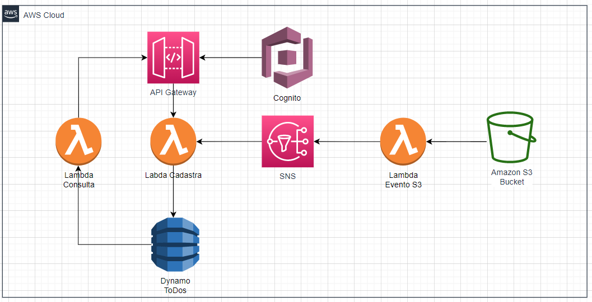

# servelessawstodos
serverless aws application to manage tasls using terraform, lambda, api gateway, dynamodb and cognito

# Todos using serverless aws

Serverless aws application to manage tasks using terraform, lambda, api gateway, dynamodb and cognito.

